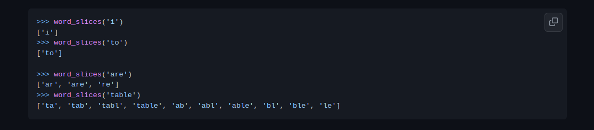

# Here is a list of Exercises

## Exercise 1

* Write a function that accepts a string input and returns slices

if input string is less than 3 characters long, return a list with input string as the only element
otherwise, return list with all string slices greater than 1 character long
order of slices should be same as shown in examples below:

